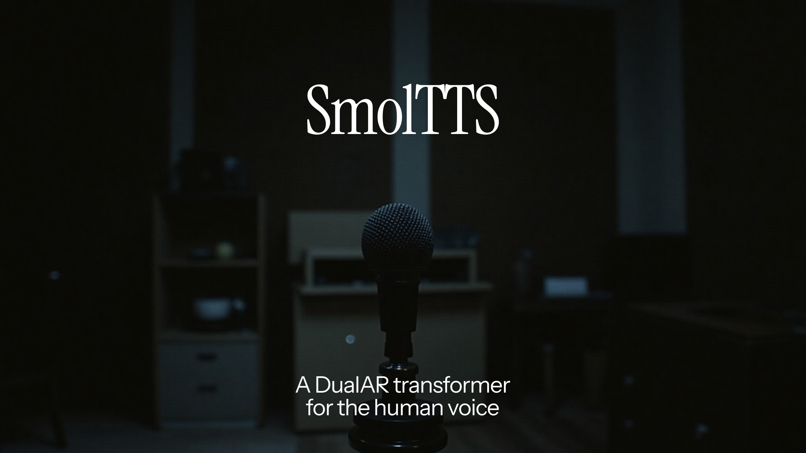

# SmolTTS: a DualAR transformer laboratory



This repo is a personal laboratory for training fully autoregressive text-audio multimodal models with the DualAR Transformer architecture. This architecture is most popularly used as the neural codec seq2seq backbone for:

- [Fish Speech TTS](https://github.com/fishaudio/fish-speech)
- Kyutai's [Moshi](https://github.com/kyutai-labs/moshi) model early in pretraining before adaptation to duplex audio.

Models trained here will be compatible with my DualAR [fish-speech.rs](https://github.com/EndlessReform/fish-speech.rs/blob/main/README.md) inference engine.

Please do not expect anything here to be usable currently. Full documentation will come once an early artifact is good enough to release.

## Datasets

- [LibriTTS-R](https://huggingface.co/datasets/jkeisling/libritts-r-mimi) encoded with [Mimi](https://huggingface.co/kyutai/mimi) codec. ~460 hours of data.

## Workspace setup

Unfortunately, HF Datasets using audio columns require librosa, which has a hard Python 3.9 dependency for inexplicable reasons.
If you are not creating a new dataset using raw audio instead of Mimi codes, please feel free to ignore this.

```bash
# If you are not making new audio datasets, feel free to use a sane Python version instead
uv sync
uv pip install -e .
```

Create a `.env` file and add:

```bash
HUGGINGFACE_TOKEN=sk-placeholder
```

For the dataset and init, see `data_pipeline/README.md`.